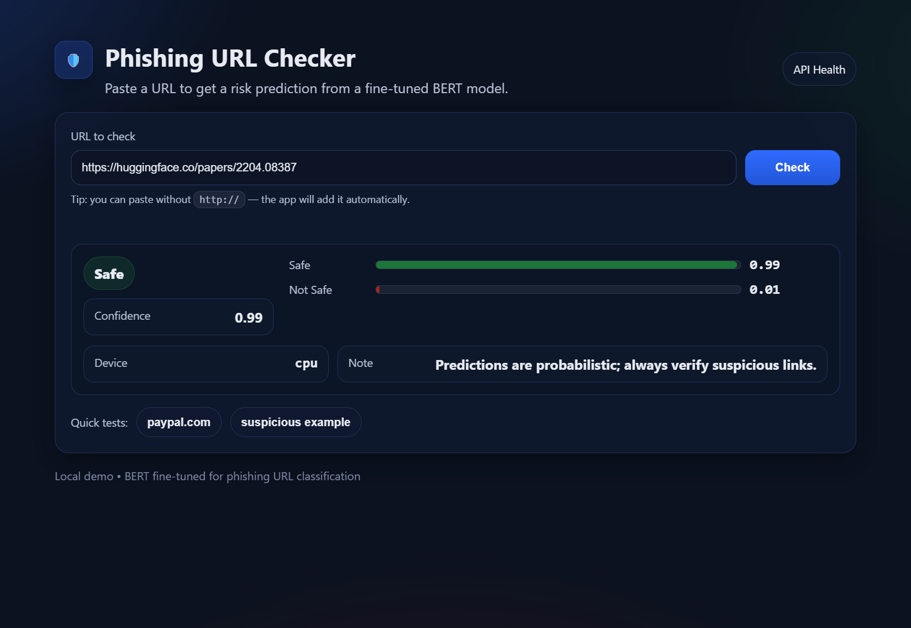

# 🛡️ Phishing URL Detection using BERT

This project is an end-to-end machine learning application that detects whether a given URL is **Safe** or **Not Safe (Phishing)** using a fine-tuned **BERT** model.  
It includes model training, evaluation, and deployment as a web application.

---

## 🚀 Features

- Fine-tuned **BERT (bert-base-uncased)** for phishing URL classification
- Binary classification: **Safe / Not Safe**
- Flask backend API
- Web interface built with HTML, CSS, and JavaScript
- Real-time URL prediction
- CPU-based inference (GPU optional)

---

## 🧠 Model Overview

- **Model:** BERT (Transformer)
- **Task:** Binary sequence classification
- **Dataset:** Phishing URL classification dataset
- **Labels:**
  - `0` → Safe
  - `1` → Not Safe

### 📊 Evaluation Results
- **Accuracy:** ~89%
- **ROC-AUC:** ~0.95

These results show strong performance in detecting phishing URLs.

---
## 🖥️ Web Interface Demo

Below is a screenshot of the phishing URL detection web interface:

## 📁 Project Structure

